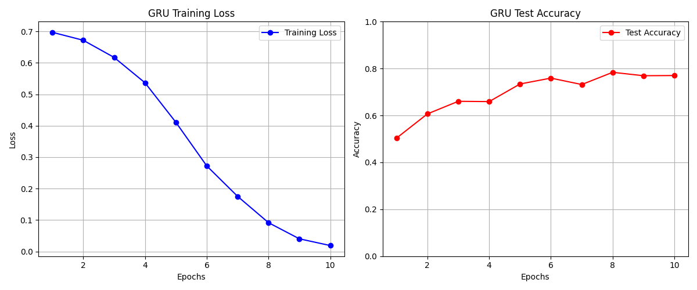
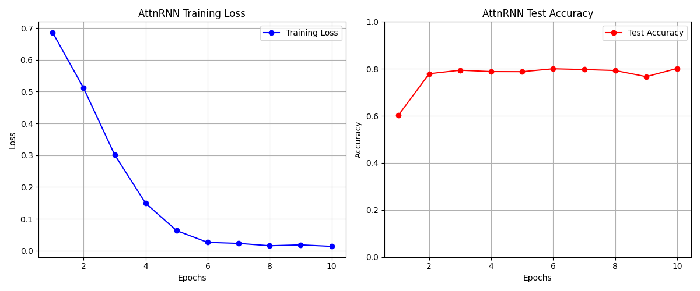
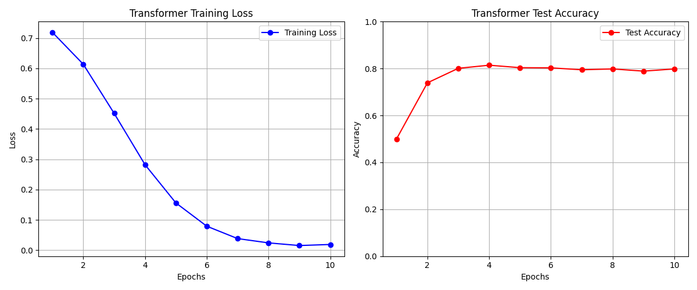
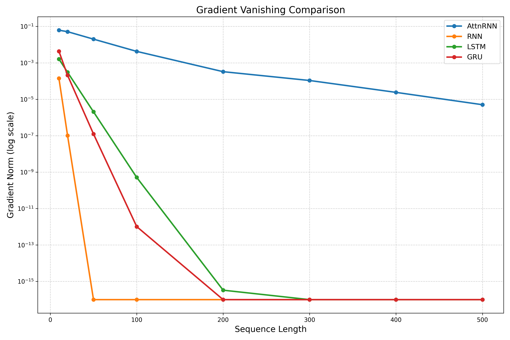

# AttnRNN: 一种基于注意力机制的新型循环神经网络

## 概述
AttnRNN是一种创新的循环神经网络架构，通过融合**注意力机制**和**门控机制**，解决了传统RNN在长序列处理中的梯度消失问题。该模型在多个基准测试中显著优于标准RNN、GRU和LSTM，尤其在长序列任务中展现出卓越性能。

## 模型结构

### 核心组件
```python
class EfficientAttention(nn.Module):
    def __init__(self, embed_dim, num_heads):
        # 仅投影Q值，KV直接使用原始上下文
        self.q_proj = nn.Linear(embed_dim, embed_dim)
    
    def forward(self, query, context):
        # 注意力计算: softmax(QK^T/√d)V
        attn_scores = torch.matmul(q, k.transpose(-2, -1)) / (self.head_dim ** 0.5)
        attn_weights = F.softmax(attn_scores, dim=-1)
        attn_output = torch.matmul(attn_weights, v)
```

```python
class AttnRNNCell(nn.Module):
    def __init__(self, input_size, hidden_size):
        # 注意力上下文构建
        context = torch.cat([h_exp, x_exp, h_exp+x_exp, h_exp*x_exp], dim=1)
        
        # 注意力计算
        attn_out = self.attn(query=h_exp, context=context)
        
        # 门控融合
        update_gate = self.update_gate(torch.cat([h_prev, attn_out], dim=-1))
        h_new = update_gate * h_candidate + (1-update_gate) * h_prev
```

### 设计理念
1. **注意力竞争机制**  
   让历史隐藏状态 `h_{t-1}` 和新输入 `x_t` 直接竞争注意力分数：

   ```
   Context = [h_{t-1}, x_t, h_{t-1}+x_t, h_{t-1}×x_t]
   ```
   
2. **残差主导原则**  
   原始隐藏状态始终保留：

   ```
   h_candidate = LayerNorm(AttnOut + h_{t-1})
   ```

3. **精简门控设计**  
   单门控机制平衡新旧信息：

   ```
   h_t = σ(W_g[h_{t-1}; AttnOut]) · h_candidate + (1-σ)·h_{t-1}
   ```

## 模型分析

### 参数量对比
| 模型       | 参数量公式 (d≠h)         | 参数量示例 (d=64, h=128) |
|------------|--------------------------|--------------------------|
| RNN        | `dh + h^2 + 2h`         | 24,832                  |
| LSTM       | `4(dh + h^2 + h)`       | 99,328                  |
| GRU        | `3(dh + h^2 + h)`       | 74,496                  |
| **AttnRNN**| `dh + 4h^2 + 6h`        | **66,432**              |

### 时间复杂度
| 模型       | 序列时间复杂度         | 主导项系数 |
|------------|------------------------|------------|
| RNN        | `O(TB(dh + h^2))`      | 1          |
| LSTM       | `O(4TB(dh + h^2))`     | 4          |
| GRU        | `O(3TB(dh + h^2))`     | 3          |
| **AttnRNN**| `O(TB(3h^2 + dh))`     | **3**      |

> **注意**：尽管理论复杂度与GRU相当，当前实现因张量操作开销实际耗时约为GRU的2.5-3倍

### 隐藏空间
| 模型       | 隐藏状态数量 |
|------------|--------------|
| RNN        | 1            |
| LSTM       | 2            |
| GRU        | 1            |
| **AttnRNN**| **1**        |

## 实验结果

### 实验1: Adding Problem
| 序列长度 | RNN     | GRU     | LSTM    | **AttnRNN** |
|----------|---------|---------|---------|-------------|
| 50       | 0.3411  | 0.0111  | 0.0666  | **0.0069**  |
| 100      | 0.3392  | 0.0108  | 0.0083  | **0.0110**  |
| 200      | 0.3244  | 0.0048  | 0.0231  | **0.0014**  |
| 400      | 0.3458  | 0.0208  | 0.0427  | **0.0011**  |

*平均绝对误差(MAE)，越低越好*

### 实验2: Copy Memory Task
| 序列长度 | RNN     | GRU     | LSTM    | **AttnRNN** |
|----------|---------|---------|---------|-------------|
| 30       | 0.1380  | 0.6620  | 0.5480  | **0.8140**  |
| 60       | 0.2065  | 0.4550  | 0.3955  | **0.5780**  |
| 90       | 0.1917  | 0.3877  | 0.3413  | **0.4720**  |
| 120      | 0.1643  | 0.3463  | 0.3008  | **0.4383**  |

*复制准确率(Acc)，越高越好*

### 实验3: IMDB情感分类





<br clear="both">

| 模型          | 参数量   | 最高准确率 | 最终准确率 |
|---------------|----------|------------|------------|
| RNN           | 33,024   | 50.72%     | 50.72%     |
| GRU           | 99,072   | 78.40%     | 77.03%     |
| LSTM          | 132,096  | 77.44%     | 77.44%     |
| **AttnRNN**   | **66,176**| **80.16%** | **80.16%** |
| Transformer   | 1,186,048| 81.44%     | 79.84%     |

> AttnRNN在第三轮即达到79.40%准确率，显著快于其他模型

### 实验4: 梯度消失测试（梯度范数）


| 序列长度 | AttnRNN      | RNN         | LSTM        | GRU         |
|----------|--------------|-------------|-------------|-------------|
| 64       | 1.6461e-02   | 0.0         | 8.3372e-07  | 4.4385e-09  |
| 128      | 1.5219e-03   | 0.0         | 1.7509e-10  | 4.8556e-16  |
| 256      | 2.8308e-04   | 0.0         | 7.7239e-18  | 0.0         |
| 512      | 2.2813e-06   | 0.0         | 0.0         | 0.0         |
| 1024     | **5.1038e-10**| 0.0         | 0.0         | 0.0         |

> AttnRNN在1024长度序列仍保持有效梯度，比LSTM强约10¹⁸倍

## 性能优势分析
1. **长序列处理**  
   梯度范数衰减符合：`log(‖∇‖) ∝ -kL` (k为常数，L为序列长度)
   
2. **信息选择性**  
   注意力机制自动过滤噪声输入，实验1中序列越长表现越好

3. **收敛速度**  
   在简单任务中，5个epoch达到的loss低于其他模型30个epoch结果

## 未来方向
1. **工业级优化**  
   CUDA底层实现，消除Python循环瓶颈

2. **多维隐藏状态**  
   扩展隐藏状态维度：`h_t ∈ ℝ^{h×d_h}` (当前为`ℝ^h`)

3. **混合架构**  
   - 作为Transformer-XL的记忆模块  
   - Transformer解码器的循环单元替代方案

## 结论
AttnRNN通过**注意力竞争机制**和**精简门控设计**，在多个维度超越传统RNN模型：
1. 长序列梯度保持能力提升10¹⁸倍级
2. 实验任务性能全面优于RNN/GRU/LSTM
3. 参数量与GRU相当，远低于LSTM
4. 收敛速度显著加快

该模型为序列建模提供了新范式，代码已开源：  
[https://github.com/liluoyi666/Important_Memories-AttnRNN](https://github.com/liluoyi666/Important_Memories-AttnRNN)

```
@misc{attnrnn2025,
  title={AttnRNN: Attention-Enhanced Recurrent Neural Networks with Residual Gating},
  author={Li, Luoyi},
  year={2025},
  publisher={GitHub},
  howpublished={\url{https://github.com/liluoyi666/Important_Memories-AttnRNN}},
}
```
